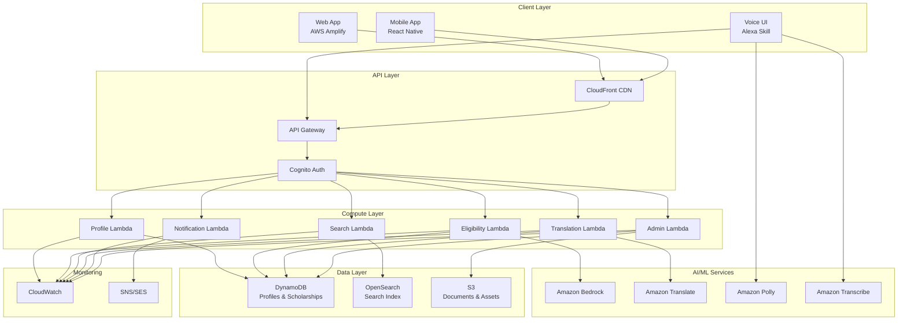

# Design Document: AI-Based Scholarship & Financial Aid Eligibility Platform

## Overview

The AI-Based Scholarship & Financial Aid Eligibility Platform is a serverless, cloud-native application built entirely on AWS infrastructure. The platform uses AI/ML services to intelligently match students with eligible scholarships, provides multilingual support through NLP services, and delivers a mobile-first experience optimized for Indian students.

The architecture follows a microservices pattern using AWS Lambda functions, with Amazon API Gateway as the entry point, DynamoDB for data persistence, and various AWS AI services (Bedrock, Comprehend, Translate, Polly, Transcribe) for intelligent features.

## High-Level Architecture

### System Components

```
┌─────────────────────────────────────────────────────────────────┐
│                        Client Layer                              │
│  ┌──────────────┐  ┌──────────────┐  ┌──────────────┐          │
│  │ Web App      │  │ Mobile App   │  │ Voice UI     │          │
│  │ (Amplify)    │  │ (React Native)│  │ (Alexa Skill)│          │
│  └──────────────┘  └──────────────┘  └──────────────┘          │
└─────────────────────────────────────────────────────────────────┘
                              │
                              ▼
┌─────────────────────────────────────────────────────────────────┐
│                    API Gateway + CloudFront                      │
│                  (Authentication via Cognito)                    │
└─────────────────────────────────────────────────────────────────┘
                              │
                              ▼
┌─────────────────────────────────────────────────────────────────┐
│                      Lambda Functions                            │
│  ┌──────────────┐  ┌──────────────┐  ┌──────────────┐          │
│  │ Profile      │  │ Eligibility  │  │ Search       │          │
│  │ Management   │  │ Matching     │  │ Service      │          │
│  └──────────────┘  └──────────────┘  └──────────────┘          │
│  ┌──────────────┐  ┌──────────────┐  ┌──────────────┐          │
│  │ Translation  │  │ Notification │  │ Admin        │          │
│  │ Service      │  │ Service      │  │ Service      │          │
│  └──────────────┘  └──────────────┘  └──────────────┘          │
└─────────────────────────────────────────────────────────────────┘
                              │
                              ▼
┌─────────────────────────────────────────────────────────────────┐
│                      AWS AI/ML Services                          │
│  ┌──────────────┐  ┌──────────────┐  ┌──────────────┐          │
│  │ Bedrock      │  │ Comprehend   │  │ Translate    │          │
│  │ (Matching AI)│  │ (NLP)        │  │ (Languages)  │          │
│  └──────────────┘  └──────────────┘  └──────────────┘          │
│  ┌──────────────┐  ┌──────────────┐                            │
│  │ Polly        │  │ Transcribe   │                            │
│  │ (Text-Speech)│  │ (Speech-Text)│                            │
│  └──────────────┘  └──────────────┘                            │
└─────────────────────────────────────────────────────────────────┘
                              │
                              ▼
┌─────────────────────────────────────────────────────────────────┐
│                      Data & Storage Layer                        │
│  ┌──────────────┐  ┌──────────────┐  ┌──────────────┐          │
│  │ DynamoDB     │  │ OpenSearch   │  │ S3           │          │
│  │ (Profiles &  │  │ (Search      │  │ (Documents & │          │
│  │ Scholarships)│  │ Index)       │  │ Assets)      │          │
│  └──────────────┘  └──────────────┘  └──────────────┘          │
└─────────────────────────────────────────────────────────────────┘
                              │
                              ▼
┌─────────────────────────────────────────────────────────────────┐
│                    Monitoring & Notifications                    │
│  ┌──────────────┐  ┌──────────────┐  ┌──────────────┐          │
│  │ CloudWatch   │  │ SNS          │  │ SES          │          │
│  │ (Logs/Metrics)│  │ (Push Notify)│  │ (Email)      │          │
│  └──────────────┘  └──────────────┘  └──────────────┘          │
└─────────────────────────────────────────────────────────────────┘
```

### Architecture Principles

1. **Serverless-First**: All compute uses AWS Lambda for automatic scaling and cost optimization
2. **AI-Powered**: Core features leverage AWS AI/ML services rather than custom models
3. **Mobile-Optimized**: CloudFront CDN and optimized assets for low-bandwidth access
4. **Security-First**: Cognito authentication, IAM roles, and encryption at rest/transit
5. **Event-Driven**: SNS/EventBridge for asynchronous processing and notifications

## Components and Interfaces

### 1. Profile Management Service

**Responsibility**: Manages student profile creation, updates, and retrieval.

**AWS Services Used**:
- AWS Lambda (compute)
- Amazon DynamoDB (storage)
- Amazon Cognito (authentication)

**API Endpoints**:
```
POST   /api/profile          - Create new student profile
GET    /api/profile/{userId} - Retrieve student profile
PUT    /api/profile/{userId} - Update student profile
DELETE /api/profile/{userId} - Delete student profile
```

**Data Model** (DynamoDB):
```typescript
interface StudentProfile {
  userId: string;              // Partition key (Cognito user ID)
  email: string;
  phoneNumber?: string;
  classLevel: string;          // "9", "10", "11", "12", "UG1", "UG2", etc.
  category: string;            // "General", "SC", "ST", "OBC", "EWS"
  annualIncome: number;        // In INR
  state: string;               // Indian state code
  preferredLanguage: string;   // ISO language code
  createdAt: string;           // ISO timestamp
  updatedAt: string;           // ISO timestamp
}
```

**Validation Rules**:
- `classLevel`: Must be one of predefined values
- `category`: Must be one of ["General", "SC", "ST", "OBC", "EWS"]
- `annualIncome`: Must be non-negative number
- `state`: Must be valid Indian state code
- `preferredLanguage`: Must be supported language code


### 2. Eligibility Matching Engine

**Responsibility**: Evaluates student profiles against scholarship eligibility criteria using AI.

**AWS Services Used**:
- AWS Lambda (compute)
- Amazon Bedrock (AI matching logic)
- Amazon DynamoDB (scholarship data)

**API Endpoints**:
```
POST /api/eligibility/match   - Get eligible scholarships for a student
POST /api/eligibility/explain - Get explanation for specific scholarship
```

**Matching Algorithm**:

The eligibility engine uses a two-phase approach:

1. **Rule-Based Filtering**: Fast DynamoDB queries filter scholarships by hard constraints
2. **AI-Enhanced Ranking**: Amazon Bedrock ranks results and handles complex conditional logic

**Eligibility Rule Structure**:
```typescript
interface EligibilityRule {
  field: string;              // "classLevel", "category", "income", "state"
  operator: string;           // "equals", "in", "lessThan", "greaterThan", "between"
  value: any;                 // Comparison value(s)
  logicalOperator?: string;   // "AND", "OR" for combining rules
}

interface Scholarship {
  scholarshipId: string;      // Partition key
  title: string;
  description: string;
  provider: string;
  amount: number;             // In INR
  deadline: string;           // ISO date
  eligibilityRules: EligibilityRule[];
  requiredDocuments: string[];
  applicationLink: string;
  category: string;           // "Government", "Private", "Merit", "Need-based"
  state?: string;             // If state-specific
  createdAt: string;
  updatedAt: string;
}
```

**Matching Logic**:
```typescript
function evaluateEligibility(profile: StudentProfile, scholarship: Scholarship): boolean {
  for (const rule of scholarship.eligibilityRules) {
    const profileValue = profile[rule.field];
    const isMatch = evaluateRule(profileValue, rule.operator, rule.value);
    
    if (!isMatch && rule.logicalOperator !== "OR") {
      return false;
    }
  }
  return true;
}
```

**AI Enhancement with Bedrock**:
- Handles natural language eligibility descriptions
- Interprets complex conditional rules
- Provides confidence scores for borderline cases
- Suggests similar scholarships when no exact match exists

### 3. Explanation Generator

**Responsibility**: Generates human-readable explanations of eligibility decisions.

**AWS Services Used**:
- AWS Lambda (compute)
- Amazon Bedrock (NLP generation)
- Amazon Comprehend (text analysis)

**API Endpoints**:
```
POST /api/explanation/generate - Generate eligibility explanation
```

**Explanation Types**:

1. **Positive Match**: Why student qualifies
2. **Negative Match**: Which criteria are not met
3. **Partial Match**: What needs to change to qualify

**Prompt Template for Bedrock**:
```
Generate a simple, encouraging explanation for a student about their scholarship eligibility.

Student Profile:
- Class: {classLevel}
- Category: {category}
- Annual Income: ₹{annualIncome}
- State: {state}

Scholarship: {scholarshipTitle}
Eligibility Result: {matched/not_matched}
Criteria Evaluated: {criteriaList}

Explain in simple language why the student {does/does not} qualify. 
If not qualified, suggest what could change.
Tone: Encouraging and supportive.
Language: Simple, avoid technical jargon.
```

### 4. Translation Service

**Responsibility**: Translates scholarship content into student's preferred language.

**AWS Services Used**:
- AWS Lambda (compute)
- Amazon Translate (translation)
- Amazon DynamoDB (translation cache)

**API Endpoints**:
```
POST /api/translate - Translate text to target language
```

**Supported Languages**:
- English (en)
- Hindi (hi)
- Tamil (ta)
- Telugu (te)
- Bengali (bn)
- Marathi (mr)
- Gujarati (gu)

**Translation Strategy**:
```typescript
interface TranslationCache {
  sourceText: string;         // Partition key (hash of text)
  targetLanguage: string;     // Sort key
  translatedText: string;
  createdAt: string;
  ttl: number;                // DynamoDB TTL for cache expiration
}

async function translateContent(text: string, targetLang: string): Promise<string> {
  // Check cache first
  const cached = await getCachedTranslation(text, targetLang);
  if (cached) return cached;
  
  // Translate using Amazon Translate
  const translated = await amazonTranslate.translateText({
    Text: text,
    SourceLanguageCode: 'en',
    TargetLanguageCode: targetLang
  });
  
  // Cache result
  await cacheTranslation(text, targetLang, translated);
  
  return translated;
}
```

**Optimization**:
- Cache translations in DynamoDB with 30-day TTL
- Batch translate scholarship descriptions during off-peak hours
- Pre-translate common UI strings


### 5. Search Service

**Responsibility**: Enables full-text search across scholarships with eligibility filtering.

**AWS Services Used**:
- AWS Lambda (compute)
- Amazon OpenSearch (search engine)
- Amazon DynamoDB Streams (data sync)

**API Endpoints**:
```
GET /api/search?q={query}&filters={filters} - Search scholarships
```

**OpenSearch Index Structure**:
```json
{
  "mappings": {
    "properties": {
      "scholarshipId": { "type": "keyword" },
      "title": { "type": "text", "analyzer": "standard" },
      "description": { "type": "text", "analyzer": "standard" },
      "provider": { "type": "text" },
      "amount": { "type": "integer" },
      "deadline": { "type": "date" },
      "category": { "type": "keyword" },
      "state": { "type": "keyword" },
      "eligibilityRules": { "type": "nested" }
    }
  }
}
```

**Search Query Logic**:
```typescript
async function searchScholarships(
  query: string, 
  filters: SearchFilters, 
  studentProfile: StudentProfile
): Promise<SearchResult[]> {
  
  // Build OpenSearch query
  const searchQuery = {
    bool: {
      must: [
        { multi_match: { query, fields: ["title^2", "description", "provider"] } }
      ],
      filter: buildFilters(filters)
    }
  };
  
  // Execute search
  const results = await openSearchClient.search({ query: searchQuery });
  
  // Post-process: mark eligible scholarships
  const enrichedResults = results.map(scholarship => ({
    ...scholarship,
    isEligible: evaluateEligibility(studentProfile, scholarship)
  }));
  
  return enrichedResults;
}
```

**Data Synchronization**:
- DynamoDB Streams trigger Lambda on scholarship updates
- Lambda function updates OpenSearch index in real-time
- Ensures search index stays consistent with source data

### 6. Voice Interface Service

**Responsibility**: Enables voice input and text-to-speech output for accessibility.

**AWS Services Used**:
- AWS Lambda (compute)
- Amazon Transcribe (speech-to-text)
- Amazon Polly (text-to-speech)
- Amazon S3 (audio file storage)

**API Endpoints**:
```
POST /api/voice/transcribe - Convert speech to text
POST /api/voice/synthesize - Convert text to speech
```

**Voice Input Flow**:
```typescript
async function processVoiceInput(audioFile: Buffer, language: string): Promise<string> {
  // Upload audio to S3
  const s3Key = await uploadToS3(audioFile);
  
  // Start transcription job
  const job = await transcribe.startTranscriptionJob({
    TranscriptionJobName: generateJobName(),
    LanguageCode: language,
    Media: { MediaFileUri: `s3://bucket/${s3Key}` }
  });
  
  // Wait for completion
  const result = await waitForTranscription(job.TranscriptionJobName);
  
  return result.transcript;
}
```

**Voice Output Flow**:
```typescript
async function synthesizeSpeech(text: string, language: string): Promise<string> {
  // Select appropriate voice for language
  const voiceId = getVoiceForLanguage(language);
  
  // Synthesize speech
  const audio = await polly.synthesizeSpeech({
    Text: text,
    OutputFormat: 'mp3',
    VoiceId: voiceId,
    LanguageCode: language
  });
  
  // Upload to S3 and return URL
  const audioUrl = await uploadAudioToS3(audio.AudioStream);
  
  return audioUrl;
}
```

**Voice Command Processing**:
- Natural language understanding for commands like "show me scholarships"
- Intent recognition using Amazon Lex (optional enhancement)
- Context-aware responses based on user's current state

### 7. Notification Service

**Responsibility**: Sends deadline reminders and important updates to students.

**AWS Services Used**:
- AWS Lambda (compute)
- Amazon EventBridge (scheduling)
- Amazon SNS (push notifications)
- Amazon SES (email)
- Amazon DynamoDB (tracking)

**API Endpoints**:
```
POST /api/notifications/subscribe   - Subscribe to scholarship reminders
POST /api/notifications/unsubscribe - Unsubscribe from reminders
```

**Notification Types**:
```typescript
enum NotificationType {
  DEADLINE_7_DAYS = "deadline_7_days",
  DEADLINE_1_DAY = "deadline_1_day",
  NEW_SCHOLARSHIP = "new_scholarship",
  PROFILE_INCOMPLETE = "profile_incomplete"
}

interface NotificationPreference {
  userId: string;
  scholarshipId: string;
  notificationTypes: NotificationType[];
  channels: ("email" | "sms" | "push")[];
  createdAt: string;
}
```

**Scheduling Logic**:
```typescript
async function scheduleDeadlineReminders(scholarship: Scholarship) {
  const deadline = new Date(scholarship.deadline);
  
  // Schedule 7-day reminder
  const sevenDaysBefore = new Date(deadline);
  sevenDaysBefore.setDate(deadline.getDate() - 7);
  
  await eventBridge.putRule({
    Name: `reminder-7d-${scholarship.scholarshipId}`,
    ScheduleExpression: `at(${sevenDaysBefore.toISOString()})`
  });
  
  // Schedule 1-day reminder
  const oneDayBefore = new Date(deadline);
  oneDayBefore.setDate(deadline.getDate() - 1);
  
  await eventBridge.putRule({
    Name: `reminder-1d-${scholarship.scholarshipId}`,
    ScheduleExpression: `at(${oneDayBefore.toISOString()})`
  });
}
```

**Notification Delivery**:
```typescript
async function sendNotification(
  userId: string, 
  message: string, 
  channels: string[]
) {
  const user = await getUser(userId);
  
  if (channels.includes("email") && user.email) {
    await ses.sendEmail({
      Source: "noreply@scholarships.example.com",
      Destination: { ToAddresses: [user.email] },
      Message: {
        Subject: { Data: "Scholarship Deadline Reminder" },
        Body: { Text: { Data: message } }
      }
    });
  }
  
  if (channels.includes("push") && user.deviceToken) {
    await sns.publish({
      TargetArn: user.deviceToken,
      Message: message
    });
  }
}
```


### 8. Admin Service

**Responsibility**: Manages scholarship data, monitors system health, and handles administrative tasks.

**AWS Services Used**:
- AWS Lambda (compute)
- Amazon DynamoDB (storage)
- Amazon S3 (bulk imports)
- Amazon CloudWatch (monitoring)

**API Endpoints**:
```
POST   /api/admin/scholarships        - Create new scholarship
PUT    /api/admin/scholarships/{id}   - Update scholarship
DELETE /api/admin/scholarships/{id}   - Delete scholarship
POST   /api/admin/scholarships/import - Bulk import from CSV/JSON
GET    /api/admin/metrics              - Get system metrics
```

**Bulk Import Flow**:
```typescript
async function importScholarships(s3Key: string): Promise<ImportResult> {
  // Download file from S3
  const file = await s3.getObject({ Bucket: "imports", Key: s3Key });
  const scholarships = parseCSV(file.Body);
  
  // Validate each scholarship
  const validationResults = scholarships.map(validateScholarship);
  const valid = validationResults.filter(r => r.isValid);
  const invalid = validationResults.filter(r => !r.isValid);
  
  // Batch write to DynamoDB
  await batchWriteScholarships(valid);
  
  // Index in OpenSearch
  await indexScholarships(valid);
  
  return {
    imported: valid.length,
    failed: invalid.length,
    errors: invalid.map(r => r.error)
  };
}
```

## Data Models

### DynamoDB Table Design

**Table 1: StudentProfiles**
```
Partition Key: userId (String)
Attributes: email, phoneNumber, classLevel, category, annualIncome, state, 
            preferredLanguage, createdAt, updatedAt
GSI: None (single-item lookups only)
```

**Table 2: Scholarships**
```
Partition Key: scholarshipId (String)
Attributes: title, description, provider, amount, deadline, eligibilityRules,
            requiredDocuments, applicationLink, category, state, createdAt, updatedAt
GSI-1: category-deadline-index (for filtering by category and sorting by deadline)
GSI-2: state-deadline-index (for state-specific scholarships)
```

**Table 3: NotificationPreferences**
```
Partition Key: userId (String)
Sort Key: scholarshipId (String)
Attributes: notificationTypes, channels, createdAt
GSI: scholarshipId-index (for finding all users subscribed to a scholarship)
```

**Table 4: TranslationCache**
```
Partition Key: textHash (String)
Sort Key: targetLanguage (String)
Attributes: sourceText, translatedText, createdAt, ttl
TTL: 30 days
```

### Data Access Patterns

1. **Get student profile**: Query StudentProfiles by userId
2. **Get all scholarships**: Scan Scholarships (with pagination)
3. **Get scholarships by category**: Query GSI-1 with category
4. **Get state-specific scholarships**: Query GSI-2 with state
5. **Get user's notification preferences**: Query NotificationPreferences by userId
6. **Get subscribers for scholarship**: Query GSI on NotificationPreferences by scholarshipId
7. **Get cached translation**: Query TranslationCache by textHash and targetLanguage

## System Flows

### Flow 1: Student Registration and Profile Creation

```
1. Student opens app → Amplify serves static content via CloudFront
2. Student clicks "Sign Up" → Cognito handles registration
3. Student verifies email → Cognito confirms account
4. Student fills profile form → API Gateway receives POST /api/profile
5. Lambda validates data → Writes to DynamoDB StudentProfiles table
6. Lambda returns success → UI shows "Profile Complete" message
```

### Flow 2: Eligibility Matching

```
1. Student logs in → Cognito authenticates, returns JWT token
2. Student navigates to "My Scholarships" → API Gateway receives GET /api/eligibility/match
3. Lambda retrieves student profile from DynamoDB
4. Lambda queries Scholarships table (with GSI filters for optimization)
5. Lambda evaluates each scholarship's eligibility rules against profile
6. For complex rules, Lambda calls Bedrock for AI-enhanced evaluation
7. Lambda ranks results by relevance and deadline
8. Lambda returns matched scholarships → UI displays results
```

### Flow 3: Multilingual Content Display

```
1. Student selects Hindi as preferred language → Profile updated in DynamoDB
2. UI requests scholarship details → API Gateway receives GET /api/scholarships/{id}
3. Lambda retrieves scholarship from DynamoDB
4. Lambda checks TranslationCache for Hindi translation
5. If not cached:
   a. Lambda calls Amazon Translate to translate title and description
   b. Lambda stores translation in TranslationCache with 30-day TTL
6. Lambda returns translated content → UI displays in Hindi
```

### Flow 4: Voice-Based Interaction

```
1. Student taps microphone icon → UI records audio
2. UI uploads audio to API Gateway → POST /api/voice/transcribe
3. Lambda uploads audio to S3
4. Lambda calls Amazon Transcribe with S3 URI
5. Transcribe processes audio → Returns text transcript
6. Lambda interprets command (e.g., "show me scholarships for engineering")
7. Lambda calls appropriate service (eligibility matching or search)
8. Lambda calls Amazon Polly to synthesize response
9. Lambda returns audio URL → UI plays response
```

### Flow 5: Deadline Reminder Notification

```
1. Admin creates scholarship with deadline → Stored in DynamoDB
2. Lambda schedules EventBridge rules for 7-day and 1-day reminders
3. When deadline approaches → EventBridge triggers Lambda
4. Lambda queries NotificationPreferences for subscribed users
5. For each user:
   a. Lambda retrieves user contact info from StudentProfiles
   b. Lambda sends email via SES
   c. Lambda sends push notification via SNS
6. Lambda logs notification delivery to CloudWatch
```

### Flow 6: Search with Eligibility Filtering

```
1. Student enters search query "engineering scholarship" → GET /api/search?q=engineering
2. Lambda retrieves student profile from DynamoDB
3. Lambda queries OpenSearch with full-text search
4. OpenSearch returns matching scholarships
5. Lambda evaluates eligibility for each result
6. Lambda marks each scholarship as "Eligible" or "Not Eligible"
7. Lambda sorts results (eligible first, then by relevance)
8. Lambda returns enriched results → UI displays with eligibility badges
```


## AWS Integration Strategy

### Service Selection Rationale

**AI/ML Services**:
- **Amazon Bedrock**: Primary choice for eligibility matching and explanation generation due to foundation model capabilities and no model training required
- **Amazon Comprehend**: Backup for NLP tasks if Bedrock is unavailable
- **Amazon Translate**: Multilingual support for 7+ Indian languages
- **Amazon Polly**: Text-to-speech with Indian English and Hindi voices
- **Amazon Transcribe**: Speech-to-text with support for Indian languages

**Compute & API**:
- **AWS Lambda**: Serverless compute for all backend logic, auto-scaling, pay-per-use
- **Amazon API Gateway**: RESTful API with built-in throttling, caching, and authentication
- **AWS Amplify**: Frontend hosting with CI/CD pipeline

**Data & Storage**:
- **Amazon DynamoDB**: NoSQL database for profiles and scholarships, single-digit millisecond latency
- **Amazon OpenSearch**: Full-text search with advanced filtering
- **Amazon S3**: Document storage, bulk imports, audio files

**Notifications & Monitoring**:
- **Amazon EventBridge**: Scheduled deadline reminders
- **Amazon SNS**: Push notifications and system alerts
- **Amazon SES**: Email notifications
- **Amazon CloudWatch**: Centralized logging, metrics, and dashboards

**Security & Identity**:
- **Amazon Cognito**: User authentication, JWT tokens, social login
- **AWS IAM**: Service-to-service authentication with least-privilege policies
- **AWS KMS**: Encryption key management for sensitive data

### Cost Optimization

1. **DynamoDB On-Demand**: Pay only for actual reads/writes, no capacity planning
2. **Lambda Reserved Concurrency**: For predictable workloads (e.g., scheduled reminders)
3. **CloudFront Caching**: Reduce origin requests for static content
4. **Translation Caching**: Store translations in DynamoDB to avoid repeated API calls
5. **S3 Intelligent-Tiering**: Automatic cost optimization for stored documents

### Scalability Considerations

- **Lambda Concurrency**: Auto-scales to 1000 concurrent executions per region
- **DynamoDB**: Auto-scaling based on traffic patterns
- **API Gateway**: Handles 10,000 requests per second per account
- **CloudFront**: Global CDN with edge locations across India
- **OpenSearch**: Cluster can scale horizontally by adding nodes

## Correctness Properties

*A property is a characteristic or behavior that should hold true across all valid executions of a system—essentially, a formal statement about what the system should do. Properties serve as the bridge between human-readable specifications and machine-verifiable correctness guarantees.*

### Property 1: Profile Data Completeness

*For any* student profile creation request with all required fields (classLevel, category, annualIncome, state), the stored profile in DynamoDB should contain exactly those fields with their original values.

**Validates: Requirements 1.1**

### Property 2: Profile Validation Correctness

*For any* profile submission, if any required field is missing or improperly formatted, the validation function should reject it and return specific error messages for each invalid field.

**Validates: Requirements 1.2**

### Property 3: Profile Update Round-Trip

*For any* valid profile update (including language preference changes), retrieving the profile immediately after the update should return the updated values.

**Validates: Requirements 1.3, 3.1, 3.6**

### Property 4: Incomplete Profile Blocking

*For any* student profile with one or more missing required fields, attempting eligibility matching should be prevented and should return a list of the missing fields.

**Validates: Requirements 1.5**

### Property 5: Eligibility Rule Evaluation

*For any* student profile and scholarship with defined eligibility rules, the matching engine should return true if and only if all eligibility rules evaluate to true for that profile.

**Validates: Requirements 2.2, 2.3**

### Property 6: Complex Eligibility Logic

*For any* scholarship with nested conditional rules (AND/OR combinations), the eligibility engine should correctly evaluate the boolean logic according to standard precedence rules.

**Validates: Requirements 2.6**

### Property 7: Translation Consistency

*For any* scholarship content translated to a target language, translating it back to the source language should preserve the semantic meaning (allowing for linguistic variations).

**Validates: Requirements 3.2**

### Property 8: Explanation Completeness for Matches

*For any* matched scholarship, the generated explanation should reference all eligibility criteria that were evaluated and indicate why each criterion was satisfied.

**Validates: Requirements 4.1, 4.5**

### Property 9: Explanation Completeness for Non-Matches

*For any* non-matching scholarship, the generated explanation should identify at least one eligibility criterion that was not met and explain what would need to change.

**Validates: Requirements 4.2, 4.5**

### Property 10: Personalized Document Lists

*For any* scholarship with category-specific or state-specific document requirements, the displayed document list should include only documents relevant to the student's profile attributes.

**Validates: Requirements 5.1, 5.2, 5.5**

### Property 11: Valid Application Links

*For any* scholarship with an application link, the link should be a valid URL format (http/https) and should be clickable in the UI.

**Validates: Requirements 5.4**

### Property 12: Search Result Relevance

*For any* search query, all returned scholarships should contain the query terms in at least one of: title, description, or provider name (case-insensitive).

**Validates: Requirements 6.1**

### Property 13: Search with Eligibility Integration

*For any* search results displayed to a student, each scholarship should be correctly marked as "eligible" or "not eligible" based on the student's profile.

**Validates: Requirements 6.3, 6.4**

### Property 14: Filter Application

*For any* combination of filters (amount, deadline, category), all returned scholarships should satisfy every applied filter condition.

**Validates: Requirements 6.5**

### Property 15: Voice Command Recognition

*For any* supported voice command type (profile creation, scholarship browsing, search), the voice interface should correctly parse the command and invoke the appropriate service.

**Validates: Requirements 7.4**

### Property 16: Deadline Tracking Persistence

*For any* scholarship marked as "interested" by a student, the scholarship should appear in the student's tracked list until the deadline passes, at which point it should be automatically removed.

**Validates: Requirements 8.1, 8.5**

### Property 17: Reminder Scheduling

*For any* tracked scholarship with a deadline, reminders should be scheduled for exactly 7 days before and 1 day before the deadline.

**Validates: Requirements 8.2**

### Property 18: Notification Fallback

*For any* student without email or phone number in their profile, deadline reminders should be delivered only through in-app notifications.

**Validates: Requirements 8.4**

### Property 19: Reminder Opt-Out Respect

*For any* student who has opted out of a specific reminder type, no notifications of that type should be sent to them.

**Validates: Requirements 8.6**

### Property 20: Asset Optimization

*For any* image or asset served to mobile clients, the file size should be optimized (compressed) compared to the original uploaded version.

**Validates: Requirements 9.3**

### Property 21: Bundle Size Constraint

*For any* JavaScript bundle served to clients, the total size should not exceed a defined threshold (e.g., 500KB gzipped) to ensure fast load times.

**Validates: Requirements 9.6**

### Property 22: Scholarship Data Validation

*For any* scholarship creation or update request, if any required field (title, eligibility criteria, deadline, application link) is missing or invalid, the operation should be rejected with specific validation errors.

**Validates: Requirements 10.1**

### Property 23: Scholarship Update Consistency

*For any* scholarship update, querying for that scholarship immediately after the update should return the new values in all views (direct query, search results, eligibility matching).

**Validates: Requirements 10.2**

### Property 24: Automatic Expiration

*For any* scholarship whose deadline has passed, the scholarship should be automatically marked as expired and should not appear in active scholarship lists.

**Validates: Requirements 10.4**

### Property 25: Bulk Import Correctness

*For any* bulk import file containing N valid scholarships and M invalid scholarships, exactly N scholarships should be created in the database and M error records should be returned.

**Validates: Requirements 10.5**

### Property 26: API Request Logging

*For any* API request to the platform, a corresponding log entry should be created in CloudWatch containing the request method, path, user ID, and timestamp.

**Validates: Requirements 11.1**

### Property 27: Error Logging Detail

*For any* system error that occurs, the log entry should contain the error message, stack trace, and relevant context (user ID, request ID, affected resource).

**Validates: Requirements 11.2**

### Property 28: Metrics Collection

*For any* user action (profile creation, scholarship match, search), corresponding metrics should be recorded in CloudWatch for tracking active users and system usage.

**Validates: Requirements 11.3**

### Property 29: Log Retention

*For any* log entry created, it should remain accessible in CloudWatch for at least 30 days from creation.

**Validates: Requirements 11.5**

### Property 30: API Authentication

*For any* API request without a valid JWT token (except public endpoints like login/signup), the request should be rejected with a 401 Unauthorized response.

**Validates: Requirements 12.2**


## Error Handling

### Error Categories

1. **Validation Errors** (400 Bad Request)
   - Missing required fields
   - Invalid data formats
   - Out-of-range values
   - Response: Detailed field-level error messages

2. **Authentication Errors** (401 Unauthorized)
   - Missing JWT token
   - Expired token
   - Invalid token signature
   - Response: "Authentication required" message

3. **Authorization Errors** (403 Forbidden)
   - User accessing another user's data
   - Non-admin accessing admin endpoints
   - Response: "Access denied" message

4. **Not Found Errors** (404 Not Found)
   - Scholarship ID doesn't exist
   - User profile not found
   - Response: "Resource not found" message

5. **Service Errors** (500 Internal Server Error)
   - AWS service failures (Bedrock, Translate, etc.)
   - Database connection issues
   - Unexpected exceptions
   - Response: Generic error message, detailed logs in CloudWatch

6. **Rate Limiting** (429 Too Many Requests)
   - API Gateway throttling exceeded
   - Response: "Rate limit exceeded, retry after X seconds"

### Error Response Format

```typescript
interface ErrorResponse {
  error: {
    code: string;           // Machine-readable error code
    message: string;        // Human-readable message
    details?: any;          // Additional context (e.g., validation errors)
    requestId: string;      // For tracking in logs
  }
}
```

### Retry Strategy

**Transient Errors**: Implement exponential backoff for AWS service calls
```typescript
async function callWithRetry<T>(
  operation: () => Promise<T>,
  maxRetries: number = 3
): Promise<T> {
  for (let attempt = 0; attempt < maxRetries; attempt++) {
    try {
      return await operation();
    } catch (error) {
      if (attempt === maxRetries - 1 || !isRetryable(error)) {
        throw error;
      }
      await sleep(Math.pow(2, attempt) * 1000); // Exponential backoff
    }
  }
}
```

**Circuit Breaker**: For external service calls (Bedrock, Translate)
- Open circuit after 5 consecutive failures
- Half-open after 30 seconds to test recovery
- Close circuit after 2 successful calls

### Graceful Degradation

1. **Translation Service Failure**: Fall back to English content
2. **Bedrock Unavailable**: Use rule-based matching only
3. **OpenSearch Down**: Fall back to DynamoDB scan (slower but functional)
4. **Voice Services Unavailable**: Disable voice features, show text-only UI
5. **Notification Service Failure**: Log error, continue processing, retry later

### Error Monitoring

- **CloudWatch Alarms**: Trigger on error rate > 5% of requests
- **SNS Alerts**: Notify administrators of critical failures
- **Error Dashboards**: Real-time visualization of error trends
- **Automated Remediation**: Lambda function to restart failed services

## Testing Strategy

### Dual Testing Approach

The platform requires both unit testing and property-based testing for comprehensive coverage:

- **Unit Tests**: Verify specific examples, edge cases, and error conditions
- **Property Tests**: Verify universal properties across all inputs using randomized test data

Both approaches are complementary and necessary. Unit tests catch concrete bugs in specific scenarios, while property tests verify general correctness across a wide range of inputs.

### Property-Based Testing Configuration

**Library Selection**: 
- **JavaScript/TypeScript**: fast-check
- **Python**: Hypothesis

**Test Configuration**:
- Minimum 100 iterations per property test (due to randomization)
- Each property test must reference its design document property
- Tag format: `Feature: scholarship-eligibility-platform, Property {number}: {property_text}`

**Example Property Test** (TypeScript with fast-check):
```typescript
import fc from 'fast-check';

// Feature: scholarship-eligibility-platform, Property 3: Profile Update Round-Trip
test('Profile updates are immediately reflected in retrievals', async () => {
  await fc.assert(
    fc.asyncProperty(
      fc.record({
        userId: fc.uuid(),
        classLevel: fc.constantFrom('9', '10', '11', '12', 'UG1', 'UG2'),
        category: fc.constantFrom('General', 'SC', 'ST', 'OBC', 'EWS'),
        annualIncome: fc.integer({ min: 0, max: 10000000 }),
        state: fc.constantFrom('MH', 'DL', 'KA', 'TN', 'UP'),
        preferredLanguage: fc.constantFrom('en', 'hi', 'ta', 'te')
      }),
      async (profile) => {
        // Create profile
        await createProfile(profile);
        
        // Update a field
        const updatedProfile = { ...profile, preferredLanguage: 'hi' };
        await updateProfile(updatedProfile);
        
        // Retrieve and verify
        const retrieved = await getProfile(profile.userId);
        expect(retrieved.preferredLanguage).toBe('hi');
      }
    ),
    { numRuns: 100 }
  );
});
```

### Unit Testing Strategy

**Focus Areas**:
1. **Edge Cases**: Empty inputs, boundary values, null/undefined handling
2. **Error Conditions**: Invalid data, service failures, timeout scenarios
3. **Integration Points**: API Gateway → Lambda, Lambda → DynamoDB, Lambda → AWS AI services
4. **Business Logic**: Specific eligibility rule combinations, translation caching logic

**Example Unit Test**:
```typescript
describe('Eligibility Matching', () => {
  test('should reject profile with income above scholarship threshold', async () => {
    const profile = {
      userId: 'user-123',
      classLevel: '10',
      category: 'General',
      annualIncome: 500000,
      state: 'MH'
    };
    
    const scholarship = {
      scholarshipId: 'sch-456',
      title: 'Low Income Scholarship',
      eligibilityRules: [
        { field: 'annualIncome', operator: 'lessThan', value: 300000 }
      ]
    };
    
    const result = await evaluateEligibility(profile, scholarship);
    expect(result.isEligible).toBe(false);
    expect(result.reason).toContain('income exceeds threshold');
  });
});
```

### Integration Testing

**API Integration Tests**:
- Test complete request/response cycles through API Gateway
- Verify authentication and authorization
- Test error responses and status codes

**AWS Service Integration**:
- Mock AWS services using LocalStack for local testing
- Use AWS SDK mocks for unit tests
- Integration tests against real AWS services in staging environment

### End-to-End Testing

**User Flows**:
1. Student registration → Profile creation → Eligibility matching → View results
2. Student search → Apply filters → View scholarship details → Mark as interested
3. Admin login → Add scholarship → Verify it appears in student results
4. Student changes language → Verify all content is translated

**Tools**:
- Playwright or Cypress for browser automation
- Mobile testing with Appium for React Native app

### Performance Testing

**Load Testing**:
- Simulate 1000 concurrent users
- Test API response times under load
- Verify Lambda auto-scaling behavior

**Stress Testing**:
- Test system behavior at 10x expected load
- Identify breaking points
- Verify graceful degradation

**Tools**: Artillery, k6, or AWS Distributed Load Testing

### Security Testing

**Authentication Testing**:
- Verify JWT token validation
- Test token expiration handling
- Attempt unauthorized access

**Input Validation**:
- SQL injection attempts (though using DynamoDB)
- XSS attempts in scholarship descriptions
- Malformed JSON payloads

**IAM Policy Testing**:
- Verify least-privilege access
- Test cross-account access prevention

### Monitoring and Observability

**CloudWatch Dashboards**:
- API request rates and latency
- Lambda execution duration and errors
- DynamoDB read/write capacity usage
- AI service API call counts and costs

**Distributed Tracing**:
- AWS X-Ray for request tracing across services
- Identify bottlenecks and slow operations

**Alerting**:
- Error rate > 5%
- API latency > 2 seconds (p95)
- Lambda throttling events
- DynamoDB capacity exceeded

## Deployment Strategy

### Infrastructure as Code

**AWS CDK** (TypeScript):
```typescript
import * as cdk from 'aws-cdk-lib';
import * as lambda from 'aws-cdk-lib/aws-lambda';
import * as apigateway from 'aws-cdk-lib/aws-apigateway';
import * as dynamodb from 'aws-cdk-lib/aws-dynamodb';

export class ScholarshipPlatformStack extends cdk.Stack {
  constructor(scope: cdk.App, id: string, props?: cdk.StackProps) {
    super(scope, id, props);
    
    // DynamoDB Tables
    const profilesTable = new dynamodb.Table(this, 'StudentProfiles', {
      partitionKey: { name: 'userId', type: dynamodb.AttributeType.STRING },
      billingMode: dynamodb.BillingMode.PAY_PER_REQUEST,
      encryption: dynamodb.TableEncryption.AWS_MANAGED
    });
    
    // Lambda Functions
    const profileHandler = new lambda.Function(this, 'ProfileHandler', {
      runtime: lambda.Runtime.NODEJS_18_X,
      handler: 'profile.handler',
      code: lambda.Code.fromAsset('lambda'),
      environment: {
        PROFILES_TABLE: profilesTable.tableName
      }
    });
    
    profilesTable.grantReadWriteData(profileHandler);
    
    // API Gateway
    const api = new apigateway.RestApi(this, 'ScholarshipAPI', {
      restApiName: 'Scholarship Platform API',
      deployOptions: {
        stageName: 'prod',
        throttlingRateLimit: 1000,
        throttlingBurstLimit: 2000
      }
    });
    
    const profiles = api.root.addResource('profile');
    profiles.addMethod('POST', new apigateway.LambdaIntegration(profileHandler));
  }
}
```

### CI/CD Pipeline

**GitHub Actions Workflow**:
1. **Build**: Compile TypeScript, run linters
2. **Test**: Run unit tests and property tests
3. **Deploy to Staging**: Deploy CDK stack to staging environment
4. **Integration Tests**: Run E2E tests against staging
5. **Deploy to Production**: Deploy CDK stack to production (manual approval)

### Environment Strategy

- **Development**: Local development with LocalStack
- **Staging**: Full AWS environment for integration testing
- **Production**: Production environment with monitoring and alerts

### Rollback Strategy

- **Lambda Versions**: Use versioning and aliases for instant rollback
- **API Gateway Stages**: Keep previous stage deployments for quick revert
- **Database Migrations**: Use forward-compatible schema changes only
- **Feature Flags**: Use AWS AppConfig for gradual feature rollout

## Architecture Diagram



## Success Metrics and KPIs

### Technical Metrics

- **API Latency**: p95 < 500ms, p99 < 1000ms
- **Availability**: 99.9% uptime
- **Error Rate**: < 1% of requests
- **Lambda Cold Start**: < 1 second
- **Search Response Time**: < 200ms

### Business Metrics

- **User Registrations**: Track daily/weekly/monthly signups
- **Scholarship Matches**: Average matches per student
- **Language Distribution**: Usage across supported languages
- **Conversion Rate**: % of matched students who mark scholarships as interested
- **Notification Engagement**: Open rates for deadline reminders

### Cost Metrics

- **Cost per User**: Total AWS costs / active users
- **Cost per Match**: Total AWS costs / scholarship matches generated
- **Service Breakdown**: Costs by AWS service (Lambda, DynamoDB, AI services)

## Future Enhancements

1. **AI Chatbot**: Conversational interface using Amazon Lex for guided scholarship discovery
2. **Document Upload**: Allow students to upload documents to S3 for application preparation
3. **Application Tracking**: Track application status across multiple scholarships
4. **Recommendation Engine**: ML-based recommendations using Amazon Personalize
5. **Community Features**: Student forums and success stories
6. **Mobile App**: Native iOS and Android apps with offline support
7. **Analytics Dashboard**: Admin dashboard with scholarship effectiveness metrics
8. **Integration APIs**: Allow scholarship providers to directly publish opportunities
